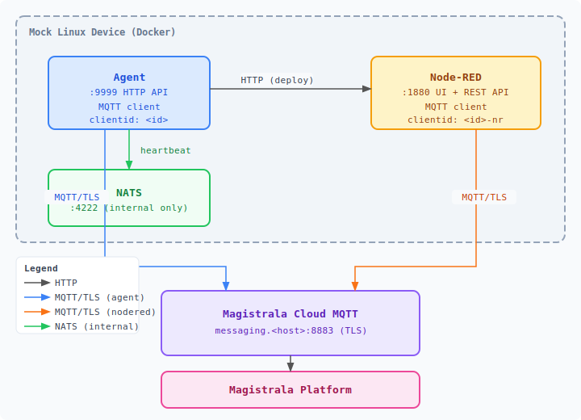

# Agent + Node-RED Integration

This guide explains how to run the Magistrala Agent with Node-RED support using a mock Linux device in Docker.

## Architecture

<p align="center">
  
</p>


## Quick Start

### 1. Build the Agent Docker image

```bash
make all && make docker_dev
```

### 2. Start the stack

```bash
make run
```

This starts: Agent (:9999), Node-RED (:1880), NATS (:4222).

### 3. Verify services

```bash
# Check agent health
curl http://localhost:9999/health

# Ping Node-RED via agent
curl -s -X POST http://localhost:9999/nodered \
  -H 'Content-Type: application/json' \
  -d '{"command":"nodered-ping"}'

# Open Node-RED UI
open http://localhost:1880
```

## Provisioning with Magistrala

If you have a running Magistrala instance, use the provisioning script to automatically create Clients, Channels, and Rule Engine rules:

```bash
export MG_PAT=<personal-access-token>
export MG_DOMAIN_ID=<domain-id>
make run_provision
```

Or with a custom API URL:

```bash
MG_API=https://my-instance/api make run_provision MG_DOMAIN_ID=<domain-id> MG_PAT=<pat>
```

Or run the script directly:

```bash
export MG_PAT=<personal-access-token>
export MG_DOMAIN_ID=<domain-id>
bash docker/nodered/provision.sh
```

This will:
1. Create a Client (device) with credentials
2. Create a Channel
3. Connect the Client to the Channel
4. Set up Bootstrap configuration
5. Configure a Rule Engine rule with `save_senml` output to persist all messages
6. Update `docker/.env` with the provisioned IDs

Then restart the agent:
```bash
docker compose up -d
```

## Deploying Node-RED Flows

### Via HTTP API

```bash
# Deploy a flow (flow JSON must be base64 encoded)
FLOWS=$(cat examples/nodered/speed-flow.json | base64 -w 0)

curl -s -X POST http://localhost:9999/nodered \
  -H 'Content-Type: application/json' \
  -d "{\"command\":\"nodered-deploy\",\"flows\":\"$FLOWS\"}"

# Fetch current flows
curl -s -X POST http://localhost:9999/nodered \
  -H 'Content-Type: application/json' \
  -d '{"command":"nodered-flows"}'

# Ping Node-RED
curl -s -X POST http://localhost:9999/nodered \
  -H 'Content-Type: application/json' \
  -d '{"command":"nodered-ping"}'

# Get flow state
curl -s -X POST http://localhost:9999/nodered \
  -H 'Content-Type: application/json' \
  -d '{"command":"nodered-state"}'
```

### Via MQTT (from Magistrala cloud)

Send a SenML array to `m/<domain-id>/c/<channel-id>/req`:

Supported commands:
- `nodered-deploy,<base64-flow>` — Deploy flows to Node-RED
- `nodered-flows` — Fetch current flows
- `nodered-ping` — Check Node-RED availability

### Via Control command

```json
[{"bn":"uuid:", "n":"control", "vs":"nodered-deploy,<base64-encoded-flow-json>"}]
```

## Example Flows

### Default flow (`docker/nodered/flows.json`)

Seeded into Node-RED on first start. It periodically publishes SenML temperature and humidity readings to the Magistrala data channel.

### Speed sensor flow (`examples/nodered/speed-flow.json`)

A ready-to-deploy example that publishes `speed` (km/h), `rpm`, and `gear` SenML records every 15 seconds. Use it to test remote flow deployment end-to-end.

### Modbus holding register flow (`examples/nodered/modbus-flow.json`)

Simulates polling 4 Modbus TCP holding registers (FC03) every 10 seconds and publishing SenML records to Magistrala:

| Register | Measurement | Unit |
|----------|-------------|------|
| HR0 | Voltage | V |
| HR1 | Current (scaled ×10) | A |
| HR2 | Power | W |
| HR3 | Temperature | °C |

The simulation function node can be replaced with a real `modbus-read` node when a physical Modbus TCP slave is available.

**Deploy via Magistrala MQTT:**

```bash
# 1. Encode the flow
FLOWS=$(cat examples/nodered/speed-flow.json | base64 -w 0)

# 2. Publish the deploy command
mosquitto_pub \
  -h <mqtt-host> -p 8883 \
  --capath /etc/ssl/certs \
  -u <client-id> -P <client-secret> \
  --id "deploy-$(date +%s)" \
  -t "m/<domain-id>/c/<channel-id>/req" \
  -m "[{\"bn\":\"req-1:\",\"n\":\"nodered\",\"vs\":\"nodered-deploy,$FLOWS\"}]"
```

The agent will:
1. Receive the SenML message over MQTT
2. Base64-decode the flow JSON
3. Patch the MQTT `clientid` in the flow to `<client-id>-nr` (prevents session conflict with the agent itself)
4. `POST` the flows to Node-RED's REST API
5. Publish the result back to the control channel

**Verify the deployment:**

```bash
mosquitto_pub \
  -h <mqtt-host> -p 8883 \
  --capath /etc/ssl/certs \
  -u <client-id> -P <client-secret> \
  --id "list-$(date +%s)" \
  -t "m/<domain-id>/c/<channel-id>/req" \
  -m '[{"bn":"req-2:", "n":"nodered", "vs":"nodered-flows"}]'
```

The agent logs will show:
```json
{"level":"INFO","msg":"NodeRed command \"nodered-deploy,...\" completed successfully.","duration":"...","uuid":"req-1"}
```

Node-RED will start publishing speed data to `m/<domain-id>/c/<channel-id>/data` within 3 seconds of deployment.

## Configuration

The Node-RED URL is configured via:

- **Environment variable**: `MG_AGENT_NODERED_URL` (default: `http://localhost:1880/`)
- **Config file** (`config.toml`):
  ```toml
  [nodered]
    url = "http://localhost:1880/"
  ```

## Environment Variables

| Variable | Default | Description |
|----------|---------|-------------|
| `MG_AGENT_NODERED_URL` | `http://localhost:1880/` | Node-RED REST API base URL |
| `MG_AGENT_CLIENT_ID` | (pre-set UUID) | Magistrala Client ID |
| `MG_AGENT_CLIENT_SECRET` | (pre-set UUID) | Magistrala Client Secret |
| `MG_AGENT_CHANNEL` | (pre-set UUID) | Channel ID (req/data/res subtopics) |
